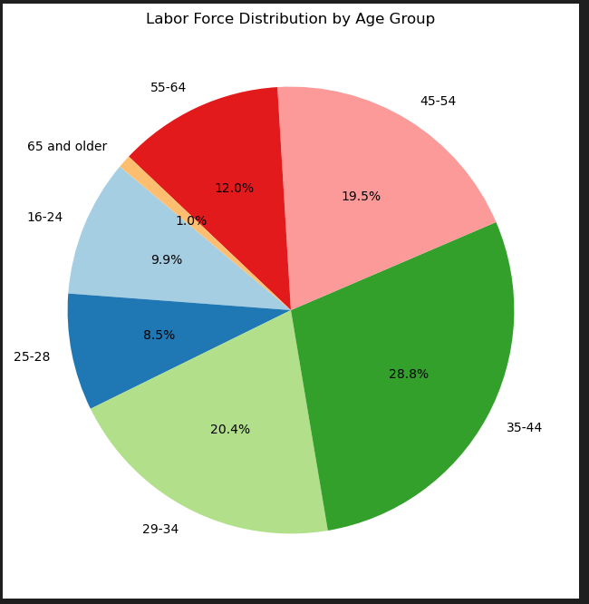
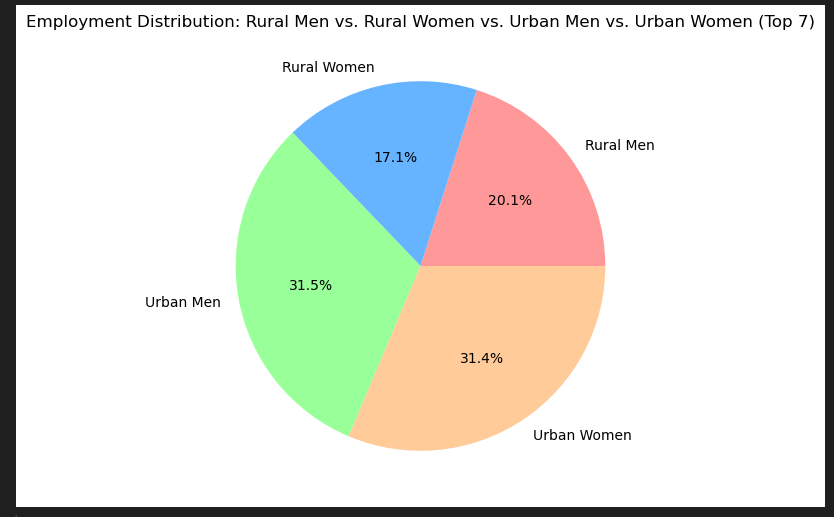
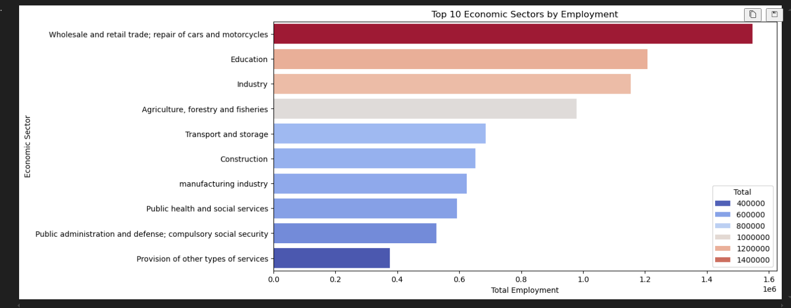
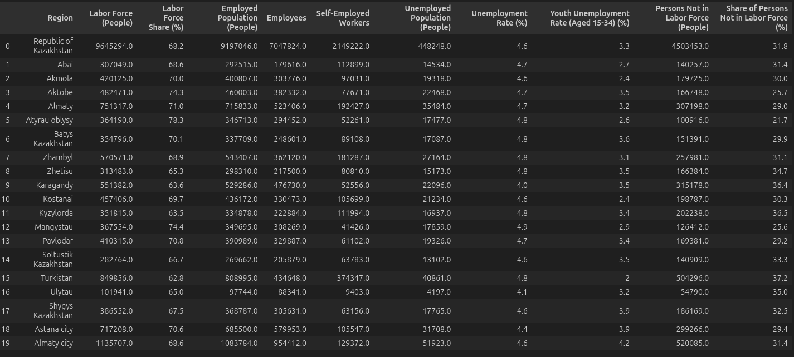

# 📌 Kazakhstan Labor Market Analysis (Q4 2024)

This project provides a comprehensive analysis of Kazakhstan’s labor market using data from the **4th quarter of 2024**. Leveraging tools like **Python**, **Pandas**, **Matplotlib**, **Seaborn**, and **Power BI**, we examine employment trends, unemployment dynamics, wage disparities, and regional labor variations. The insights aim to highlight key socio-economic patterns influencing the labor force in Kazakhstan.

---

## 📂 Data Sources

Data is available from the [Bureau of National Statistics of Kazakhstan](https://stat.gov.kz/), including information on employment, unemployment, income, and regional labor indicators.

---

## 📊 Key Analyses

### 1️⃣ Labor Force & Employment Structure
- Workforce participation by **age** and **education level**
- Employment distribution across **economic sectors**
- Gender differences in employment rates  

### 2️⃣ Industry and Sector Participation
- What is Employed population of across different employment types
- How does employment vary between urban and rural areas?
- What is the overall gender distribution in employment?
- Status and education affect on emplyment type

### 3️⃣ Wage & Work-Time Patterns
- Wage gaps by **employment type**
- Formal vs informal sector wage differences
- Income inequality and **regional wage distribution**  

### 4️⃣ Regional Labor Market Trends
- Employment and unemployment rates by **region**
- Identification of **high-participation** and **low-participation** regions
- Early signs of **remote/telecommuting** trends in the labor market  

---

## 🛠️ Tools & Technologies

| Tool         | Purpose                                      |
|--------------|----------------------------------------------|
| Python       | Data cleaning, transformation, analysis     |
| pandas, matplotlib, seaborn, plotly | Data wrangling & visualization |
| Jupyter Notebook | Interactive exploratory analysis        |
| Power BI     | Dashboards and high-level reporting         |
| Git & GitHub | Version control and collaboration           |

---

## ✅ Requirements

Install project dependencies using:

```bash
pip install -r requirements.txt
```


## Visuals & Graphs 

Some examples of visual representation










🚀 Project Status

✅ Data collected and cleaned

✅ Core labor market analysis completed

🟡 Visual dashboards in progress (Power BI)

🔜 Exporting insights and report compilation

